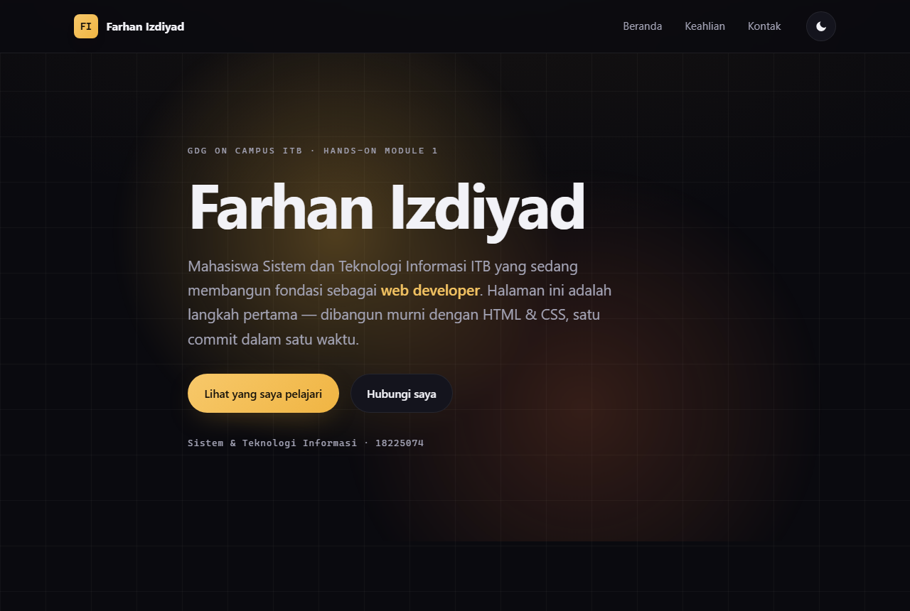
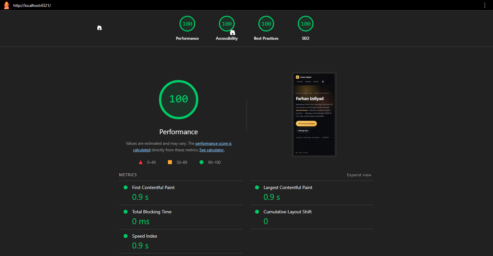

# Personal Landing Page — Farhan Izdiyad

Personal landing page untuk **GDG on Campus ITB — Hands-On Module 1: Website Development**.
Dibangun murni dengan **HTML5 + CSS3 (vanilla)** — tanpa framework, tanpa build tool, tanpa dependency.

> Skeleton homepage yang menjadi fondasi portfolio site pada module-module berikutnya.



**Lighthouse (mobile):** Performance **100** · Accessibility **100** · Best Practices **100** · SEO **100**

---

## ✨ Fitur

- **HTML semantik** — `<header>`, `<nav>`, `<main>`, `<section>`, `<footer>`; tepat satu `<h1>`, hierarki heading rapi, lolos struktur landmark.
- **Layout modern** — navigasi Flexbox, skills grid `repeat(auto-fit, minmax())` yang responsif secara intrinsik. Tanpa `float`/`position: absolute` untuk struktur.
- **Mobile-first & responsif** — tidak ada horizontal scroll pada 360px, 768px, maupun 1280px.
- **Dark & light mode** — seluruh warna sebagai CSS custom properties; toggle menyimpan preferensi di `localStorage` dan mencegah flash tema.
- **Animasi bermakna** — entrance hero staggered, underline nav (`scaleX`), hover lift pada card — semuanya `transform`/`opacity` (compositor-only), dengan guard `prefers-reduced-motion`.
- **Aksesibilitas** — kontras ≥ 4.5:1 di kedua tema, `focus-visible` yang jelas, skip link, dan accessible name pada setiap elemen interaktif.

## 🛠️ Dibangun dengan

| Aspek | Keputusan |
| :---- | :---- |
| Markup | HTML5 semantik |
| Styling | CSS3 murni — custom properties, Flexbox, Grid, `clamp()`, `color-mix()` |
| JavaScript | ~20 baris inline, **hanya** untuk toggle tema (`classList.toggle`) + persistensi |
| Font | System font stack (0 request font eksternal → tanpa render-blocking) |
| Aset | 0 KB gambar dekoratif — depth dicapai lewat gradient & shadow CSS |

## 📁 Struktur proyek

```
.
├── index.html      # Satu-satunya halaman; semantik penuh
├── styles.css      # Satu file, terorganisasi 7 layer (lihat header file)
├── README.md
└── assets/
    ├── preview.png            # Screenshot landing page
    └── lighthouse-after.png   # Bukti audit Lighthouse
```

`styles.css` disusun per-layer agar mudah dirawat: **1** Design Tokens · **2** Theme Overrides ·
**3** Reset & Base · **4** Layout Utilities · **5** Components · **6** Animations · **7** Media Queries.

## 🚀 Cara menjalankan

Tidak butuh build step. Pilih salah satu:

**1. Buka langsung**
Klik dua kali `index.html` untuk membukanya di browser.

**2. Server lokal (disarankan)**
```bash
# Python 3
python -m http.server 4321
# lalu buka http://localhost:4321
```

**3. VS Code**
Gunakan ekstensi **Live Server** → klik *Go Live*.

## 🎨 Tema & aksesibilitas

- Default **dark-first**; klik tombol tema di header untuk beralih ke light. Preferensi tersimpan otomatis.
- Aktifkan **Emulate `prefers-reduced-motion`** (DevTools → Rendering) untuk memverifikasi seluruh animasi menjadi instan.
- Navigasi **keyboard-only** (Tab) menampilkan focus ring yang jelas pada semua link dan tombol.

## 📊 Lighthouse (Bonus 3)

Halaman ini di-*engineer* untuk performa & aksesibilitas sejak awal (HTML semantik, satu file CSS
tanpa render-blocking eksternal, nol aset gambar berat, animasi compositor-only, kontras terverifikasi).
Karena itu audit langsung mencapai skor maksimal.

**Hasil audit — mode mobile, Incognito:**

| Kategori | Skor |
| :---- | :----: |
| Performance | **100** |
| Accessibility | **100** |
| Best Practices | **100** |
| SEO | **100** |

**Core metrics:** FCP 0.9 s · LCP 0.9 s · Total Blocking Time 0 ms · CLS 0 · Speed Index 0.9 s



<details>
<summary>Cara mereproduksi audit</summary>

```bash
# jalankan server lokal lebih dulu (lihat "Cara menjalankan"), lalu:
npx lighthouse http://localhost:4321/ \
  --only-categories=performance,accessibility,best-practices,seo \
  --chrome-flags="--headless=new"
```
Atau: buka DevTools → tab **Lighthouse** → mode *Navigation*, device *Mobile* → *Analyze page load*.
</details>

**Checklist optimasi yang diterapkan:**
- [x] Kontras teks/background ≥ 4.5:1 diverifikasi di dark & light
- [x] Setiap elemen interaktif punya accessible name; skip link tersedia
- [x] Tanpa render-blocking resource selain satu `styles.css`
- [x] Nol layout shift (CLS 0) — tidak ada aset tanpa dimensi
- [x] Animasi hanya `transform`/`opacity` + guard `prefers-reduced-motion`

## 📝 Catatan

- **Konten kontak:** email sudah aktif (`mailto:`); tautan **GitHub** & **LinkedIn** masih placeholder —
  ganti `href` di `index.html` bagian `<footer id="contact">` dengan profil asli.
- **Toggle tema** memakai ~20 baris JS inline (`classList.toggle`), sesuai instruksi Bonus 1
  ("toggle menggunakan class pada `<html>`/`<body>`"). Sisanya 100% HTML & CSS.

---

<sub>© 2026 Farhan Izdiyad (18225074) · Sistem & Teknologi Informasi ITB · GDG on Campus ITB Module 1</sub>
