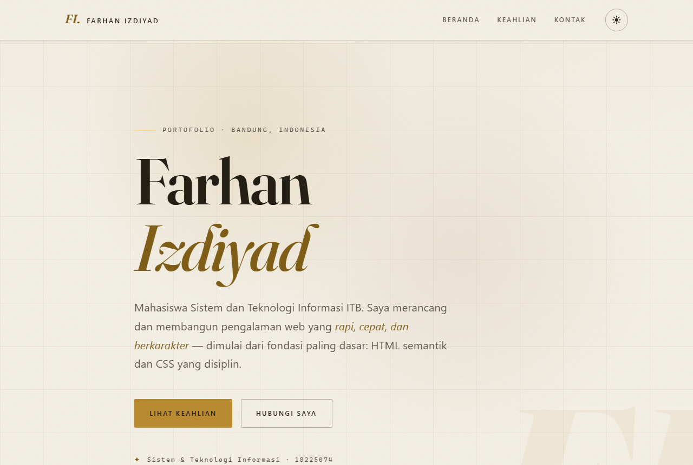

# Farhan Izdiyad — Personal Portfolio

Landing page portofolio personal, dibangun murni dengan **HTML5 + CSS3 (vanilla)** — tanpa framework, tanpa build tool, tanpa dependency. Dikerjakan sebagai submission Hands-On Module 1 (Website Development).

> Arah desain: *quiet luxury editorial* — serif Fraunces, palet espresso × champagne, hairline rules, dan grain film halus. Kesan mewah dibangun dari tipografi & cahaya, bukan berat aset.

| Dark (default) | Light |
| :---: | :---: |
|  |  |

**Lighthouse (mobile):** Performance **100** · Accessibility **100** · Best Practices **100** · SEO **100**

---

## ✨ Fitur

- **HTML semantik** — `<header>`, `<nav>`, `<main>`, `<section>`, `<footer>`; tepat satu `<h1>`, hierarki heading rapi, lolos W3C tanpa error.
- **Layout modern** — navigasi Flexbox; skills sebagai *editorial index rows* berbasis CSS Grid (`grid-template-columns` responsif per breakpoint). Tanpa `float`/`position: absolute` untuk struktur.
- **Mobile-first & responsif** — tanpa horizontal scroll pada 360px, 768px, maupun 1280px; terverifikasi via pengukuran `scrollWidth`.
- **Dark & light mode** — seluruh warna sebagai CSS custom properties; toggle men-set class pada `<body>` (sesuai spek), preferensi tersimpan di `localStorage`, tanpa flash tema saat load.
- **Animasi bermakna** — entrance hero staggered, underline nav (`scaleX`), hover wash + slide pada skill rows, panah link footer — semuanya `transform`/`opacity` (compositor-only) dengan guard `prefers-reduced-motion`.
- **Aksesibilitas** — kontras ≥ 4.5:1 di kedua tema (terukur), `focus-visible` jelas, skip link, accessible name di setiap elemen interaktif.

## 🛠️ Dibangun dengan

| Aspek | Keputusan |
| :---- | :---- |
| Markup | HTML5 semantik |
| Styling | CSS3 murni — custom properties, Flexbox, Grid, `clamp()`, `color-mix()` |
| Tipografi | **Fraunces** (1 variable font) via `preconnect` + `display=swap`; body memakai system font stack |
| JavaScript | ~20 baris inline, **hanya** untuk toggle tema (`classList.toggle` pada `<body>`) + persistensi |
| Tekstur & depth | Grain via inline SVG data-URI, glow & grid emas via gradient CSS — 0 file gambar dekoratif |

## 📁 Struktur proyek

```
.
├── index.html      # Satu-satunya halaman; semantik penuh
├── styles.css      # Satu file, terorganisasi 7 layer (lihat header file)
├── README.md
└── assets/
    ├── preview.png            # Screenshot tema gelap
    ├── preview-light.png      # Screenshot tema terang
    └── lighthouse-after.png   # Bukti audit Lighthouse
```

`styles.css` disusun per-layer agar mudah dirawat: **1** Design Tokens · **2** Theme Overrides ·
**3** Reset & Base · **4** Layout Utilities · **5** Components · **6** Animations · **7** Media Queries.

## 🚀 Cara menjalankan

Tidak butuh build step. Pilih salah satu:

**1. Buka langsung**
Klik dua kali `index.html` untuk membukanya di browser.

**2. Server lokal (disarankan)**
```bash
# Python 3
python -m http.server 4321
# lalu buka http://localhost:4321
```

**3. VS Code**
Gunakan ekstensi **Live Server** → klik *Go Live*.

## 🎨 Tema & aksesibilitas

- Default **dark-first** (espresso × champagne); klik tombol tema di header untuk beralih ke light (gading × emas antik). Preferensi tersimpan otomatis.
- Aktifkan **Emulate `prefers-reduced-motion`** (DevTools → Rendering) untuk memverifikasi seluruh animasi menjadi instan.
- Navigasi **keyboard-only** (Tab) menampilkan focus ring yang jelas pada semua link dan tombol.

## 📊 Lighthouse (Bonus 3)

Halaman di-*engineer* untuk performa & aksesibilitas sejak awal: HTML semantik, satu file CSS,
satu variable font dengan `preconnect` + `display=swap` (0 temuan render-blocking), nol gambar
dekoratif, animasi compositor-only, dan kontras terverifikasi di kedua tema.

**Hasil audit — mode mobile, Incognito:**

| Kategori | Skor |
| :---- | :----: |
| Performance | **100** |
| Accessibility | **100** |
| Best Practices | **100** |
| SEO | **100** |

**Core metrics:** FCP 1.4 s · LCP 1.4 s · Total Blocking Time 0 ms · CLS 0 · Speed Index 1.4 s


<details>
<summary>Cara mereproduksi audit</summary>

```bash
# jalankan server lokal lebih dulu (lihat "Cara menjalankan"), lalu:
npx lighthouse http://localhost:4321/ \
  --only-categories=performance,accessibility,best-practices,seo \
  --chrome-flags="--headless=new"
```
Atau: buka DevTools → tab **Lighthouse** → mode *Navigation*, device *Mobile* → *Analyze page load*.
</details>

**Checklist optimasi yang diterapkan:**
- [x] Kontras teks/background ≥ 4.5:1 diverifikasi di dark & light
- [x] Setiap elemen interaktif punya accessible name; skip link tersedia
- [x] Web font tunggal dengan `preconnect` + `font-display: swap` — 0 temuan render-blocking
- [x] Nol layout shift (CLS 0) — tidak ada aset tanpa dimensi
- [x] Animasi hanya `transform`/`opacity` + guard `prefers-reduced-motion`

## 📝 Catatan

- **Link kontak:** email sudah aktif (`mailto:`); tautan **GitHub** & **LinkedIn** masih placeholder —
  ganti `href` di `index.html` bagian `<footer id="contact">` dengan profil asli.
- **Toggle tema** memakai ~20 baris JS inline (`classList.toggle` pada `<body>`, sesuai instruksi
  Bonus 1). Sisanya 100% HTML & CSS.

---

<sub>© 2026 Farhan Izdiyad (18225074) · Sistem & Teknologi Informasi ITB</sub>
